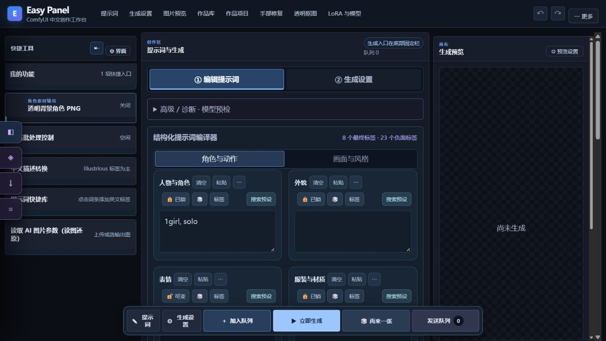
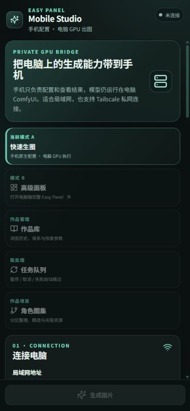

# Easy Panel 界面图解

配套 Easy Panel **2.3.2** / Android **1.4.7**。先看 [安装与第一张图](QUICKSTART.md)，再对照下面的入口操作。

桌面图为本地面板实际界面截图；截图只展示操作界面，没有提交生成任务。模型数量、收藏和提示词由个人环境决定，下载后不包含这些个人数据。手机图为同版客户端共用页面的浏览器预览，没有连接电脑，不代表真机验收。

## 1. 工作台总览

- 顶部导航进入提示词、生成设置、作品库、作品项目和图像修复工具。
- 左侧快捷工具可以展开中文描述转换、读图还原、透明背景输出和批处理控制。
- 中间先编辑提示词，再切到生成设置。
- 右侧预览本次生成结果；当前示例没有图片。
- 底部固定栏可以加入队列、立即生成或发送队列。查看和编辑参数不会自动提交。

模型与 LoRA 从顶部“LoRA 与模型”或左侧菱形快捷按钮进入，资源栏可折叠。选择实际模型后再添加 LoRA；先验证基础生成正常，再增加权重、姿势与高清等功能。

## 2. 提示词按分区修改

“角色与动作”组织人物、外貌、服装、表情与姿势；“画面与风格”组织构图、场景、光线和画风。分区之间可以分别保留、搜索预设或随机。

例如想保留同一个人物、只换背景：锁定人物与外貌，修改场景分区，检查最终文本后再生成。中文名称与说明用于阅读，写入提示词的正文使用英文。详见 [分区预设、例图与锁定](PROMPT_TOOLS.md)。

## 3. 先选比例，再调尺寸

切到“生成设置”，先选择图片比例，再调整长边或使用推荐档位。面板显示实际宽高、像素量与负载提醒；它们是估算，实际可用尺寸还取决于模型、显存和已启用功能。

截图中的尺寸是当前个人配置示例。第一次生成保持自动采样参数，使用较小推荐尺寸，并关闭高清二采、姿势控制和多人区域。

## 4. 游乐场镜头卡

在提示词区域打开“🎲 创作游乐场”，选择“镜头卡”。卡片内的图形是原创构图示意，表示人物占比、留白与相机位置，**不是模型出图样张**。

选择镜头后仍可以改草稿；尺寸按钮需要单独点击。应用之前确认哪些分区保留、追加或替换，再回主面板生成。其他玩法见 [游乐场教程](PROMPT_TOOLS.md#创作游乐场)。

## 5. 手机入口与连接

 

手机页面有快速生图、高级面板、作品库、任务队列和角色图集入口。未连接时，需要电脑数据的入口保持不可用。

1. 在电脑启动 ComfyUI 和 Easy Panel。
2. 填写电脑的局域网地址或 Tailscale 地址，端口使用 `8190`。
3. 从电脑面板目录的 `rpg_mobile_token.txt` 读取 Token，粘贴到手机。
4. 点击“测试连接”和“读取模型”。

连接成功后再编辑提示词与参数。作品库的恢复、换 Seed 和继续编辑会先回填表单；只有点击生成才提交。完整说明见 [Android 教程](../android-client/README.md) 与 [电脑 / 手机功能对照](FEATURE_MATRIX.md)。

## 截图维护

公开截图位于 `docs/screenshots`，随源码、Core 与 All 安装包一起分发。界面变化时更新对应图片并同步重建安装包。保留真实界面与正确的预览状态说明；截图前收起私人作品与预设，不填 Token / API Key，不用个人图库数量暗示安装包自带素材。
