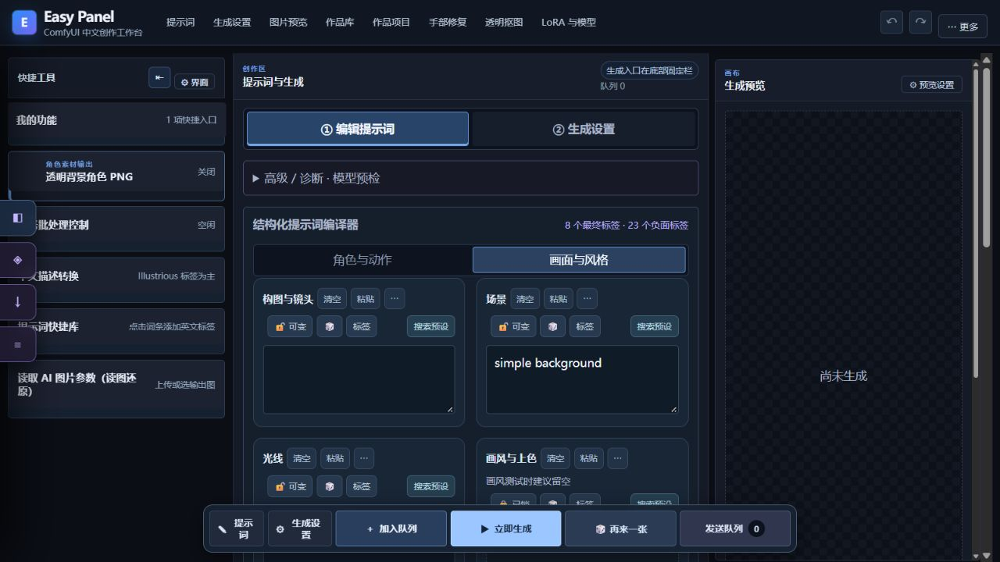
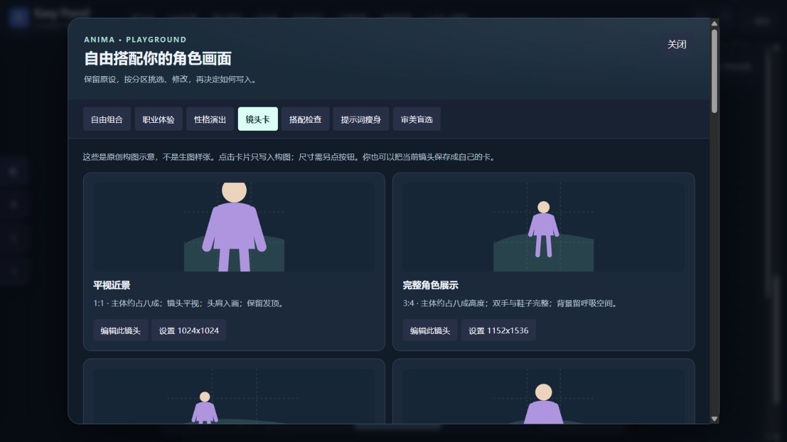

# 提示词、预设例图与创作游乐场

适用 Easy Panel **2.3.0**。手机请进入“高级面板”。所有玩法先修改或预览提示词；生成仍需点击主面板的生成按钮或发送队列。

## 分区预设与搜索



人物、外貌、表情、服装、姿势、构图、场景、光线、画风、自然语言、其他补充与负向各有对应输入区域。中文用于名称和说明，写入提示词的正文使用英文。

在输入框输入关键词，候选优先展示该分区的个人预设；方向键选择，Enter / Tab 写入。点击“搜索预设”或按 Ctrl+Space 打开搜索面板，可选追加或替换。组合预设在分区搜索中只提取当前分区，不把服装、场景等一起混入；已锁定分区保留原内容。

## 为个人预设绑定例图

编辑预设时上传 PNG / JPG / WebP，或选用当前生成结果。例图保存在面板目录的 `preset_examples`，预设引用随共享状态同步。旧预设没有图片也能使用。

随机预览与分区搜索可展示例图；点击图片放大或下载。例图是提示词的参考，实际出图仍取决于模型、LoRA 和采样参数。备份预设时同时备份 `easy_panel_shared_state.json*` 与 `preset_examples`，只复制 JSON 会缺图片。

## 可视化词条库

代码提供图库检索、分区分类、例图和自定义上传；发布包**不包含维护者个人图库的 Markdown 与原图**。没有源图库时可以正常使用面板和个人预设，也可以自行上传词条。

外部图库默认读取面板的相邻目录 `visual_tag_library`，如：

```text
工作目录/
├── ComfyUI_Easy_Panel/
└── visual_tag_library/
```

其他位置在启动前设置 `$env:EASY_PANEL_VISUAL_TAG_ROOT = 'D:\我的图库'`。源数据格式与分区规则见 [图库说明](visual-library-sections.md)。新增或编辑后重建 / 刷新索引，分区搜索与随机来源随之刷新。

图库按当前输入区域筛选和写入；如 `blue_eyes` 属于外貌，`closed_eyes` 属于表情，`holding_sword` 属于姿势。编辑时保留英文标签、中文说明与例图各自的用途。

## 随机与锁定

先锁定要保留的词条或整个分区，再随机其他内容。词条锁定保留原词及权重；整个分区锁定后禁止随机修改。分区例图可以展开 / 收起，显示偏好保存在当前浏览器。

## 创作游乐场



镜头卡图形是构图示意，不是模型生成样张。

点击“🎲 创作游乐场”，选择玩法：

| 玩法 | 操作 |
| --- | --- |
| 自由组合 | 按分区编辑草稿，用保留 / 追加 / 替换选择写入方式；应用前检查前后变化 |
| 职业体验 | 选择职业场景建议，按需挑选要应用的分区 |
| 性格演出 | 将动作与性格组合成演出描述，再预览修改 |
| 镜头卡 | 选择构图建议，保留角色与其他设定 |
| 搭配检查 | 检查动作与构图等组合冲突，修改后再生成 |
| 提示词瘦身 | 冻结当前参数与 Seed 建立对照任务，暂存后到主面板发送队列 |
| 审美盲选 | 导入图片盲选并记录偏好；演示结果与真实图片结果分别记录 |

整套配方默认主要启用姿势建议，其他分区保留；应用前自行选择分区。实验暂存到浏览器任务清单，暂存不等于开始生成。游乐场草稿、镜头卡与盲选偏好在当前浏览器保存，可用导出按钮备份 JSON。

LoRA 备忘仍遵守 [本地约定](../LORA_MEMO_RULES.md)：触发词只记录有来源的内容，人物、外貌、服装、姿势、构图等能够拆分时分别保存。
