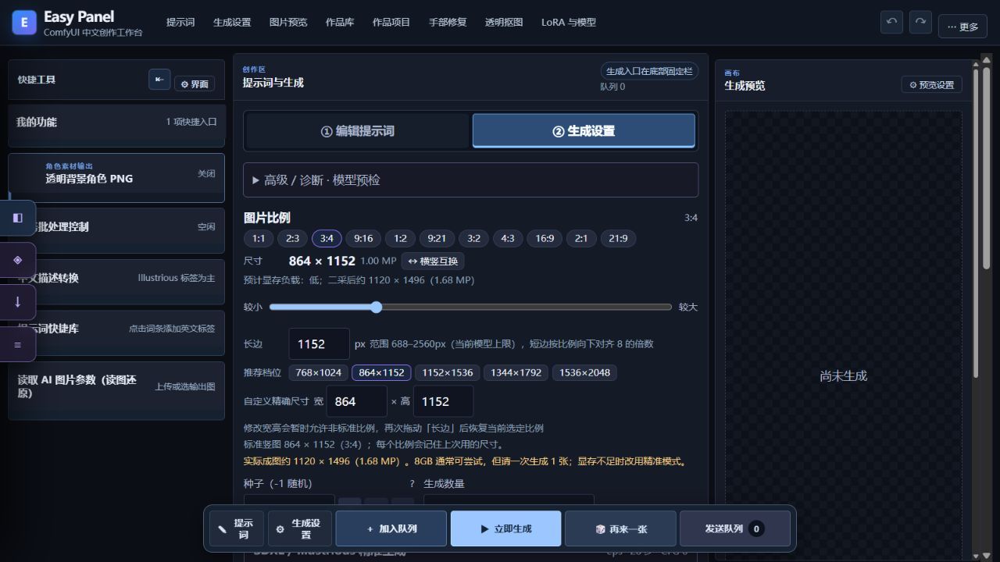
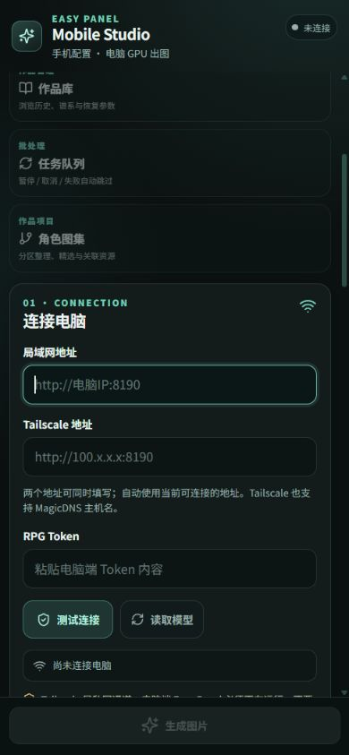

# 从安装到第一张图

当前配套：Easy Panel **2.3.3**，Android **1.4.7**。模型计算在电脑的 ComfyUI 上运行。

## 1. 先启动 ComfyUI

准备 Windows 10/11 和可以独立出图的 ComfyUI。官方便携版双击 `run_nvidia_gpu.bat`，浏览器打开 `http://127.0.0.1:8188`。先完成一次 ComfyUI 基础出图，再安装面板。

## 2. 安装 Easy Panel

在 [v2.3.3 发布页](https://github.com/ideal00/web-comfyui-controller/releases/tag/v2.3.3) 下载 `EasyPanel-Core-OneClick.zip`，完整解压后双击 `安装-核心面板.cmd`。识别失败时填写包含 `main.py`、`models`、`custom_nodes` 的 ComfyUI 目录。

首次只装 Core 即可。需要骨架提取时再装 Pose，需要 LayerStyle 调色时再装 Color；Tags 提供标签检索数据。All 会安装这些模块并检查模型，但**不包含模型权重**。

安装结束后使用生成的 `EasyPanel_一键启动.bat`。面板地址为 `http://127.0.0.1:8190`。一键关闭使用同目录的 `EasyPanel_一键关闭.bat`。

### 从源码启动

以下示例以 `G:\ComfyUI` 为工作目录，请替换成自己的路径。Python 3.10+，图像功能需要 Pillow。

```powershell
Set-Location G:\ComfyUI
git clone https://github.com/ideal00/web-comfyui-controller.git ComfyUI_Easy_Panel
Set-Location ComfyUI_Easy_Panel
$env:EASY_PANEL_COMFY_ROOT = 'G:\ComfyUI\ComfyUI_windows_portable\ComfyUI'
$env:EASY_PANEL_COMFY_URL = 'http://127.0.0.1:8188'
& '..\ComfyUI_windows_portable\python_embeded\python.exe' easy_panel.py
```

路径配置通过环境变量生效，不需要修改源代码。非便携版将最后一行替换为自己的 Python 命令。

基础图像功能依赖 `requirements.txt` 中的 Pillow；透明图缝隙清理与环境光分析还使用 NumPy、OpenCV 和 SciPy。缺少这些依赖时，在面板目录用实际运行面板的 Python 执行 `python -m pip install -r requirements-image-tools.txt`。官方便携版通常已有这些库，避免装到另一个 Python 环境。

## 3. 生成第一张图

操作入口可对照 [界面图解](INTERFACE_GUIDE.md)。尺寸设置如下：



1. 选择一个实际存在的 SDXL / Illustrious 模型。Anima 与 Krea 2 请先按 [完整说明](../README.md#33-模型文件应该放在哪里) 放好扩散模型、文本编码器和 VAE。
2. 保持自动推荐的采样器、步数和 CFG，选择一个适合显存的推荐尺寸。
3. 在人物框填 `1girl`，服装框填 `white shirt`，场景框填 `garden`；可替换为自己的英文描述。
4. 先关闭 LoRA、姿势控制、多人区域、高清二采与输出增强。
5. 点击“生成图片”，处理预检提示。完成后在预览区下载，或到 ComfyUI 的 `output` 查看原图。
6. 基础生成正常后，一次只增加一项功能，便于定位错误。

## 4. 手机连接



*同版客户端页面的浏览器预览；地址和 Token 请填写自己的连接信息。*

从 [mobile-v1.4.7 发布页](https://github.com/ideal00/web-comfyui-controller/releases/tag/mobile-v1.4.7) 下载 `app-debug.apk`。这是测试签名 APK，包名 `app.rpgbox.mobile.debug`。

使用一键启动器的手机访问配置，确保 Easy Panel 监听的地址允许手机连接；手动启动时可设置 `$env:EASY_PANEL_HOST = '0.0.0.0'`，并仅允许可信局域网 / Tailscale 访问。ComfyUI 保持 `127.0.0.1:8188`。

在手机填写 `http://电脑局域网IP:8190`，跨网络则使用电脑的 Tailscale 地址。Token 来自面板目录中的 `rpg_mobile_token.txt`。点击“测试连接”，再“读取模型”。完整连接与故障排查见 [Android 教程](../android-client/README.md)。

快速页提供常用生成操作；需要分区、LoRA 备忘、游乐场和修复工作台时打开“高级面板”。

高级面板的“生成数量”会独立保存，重新进入后恢复你选择的数量。升级后旧记录没有数量时默认 1 张；需要多图时再设置数量。

批量操作先点“加入队列”保存各组参数，再点底部“发送队列”提交。左侧“任务批处理控制”里的“运行 / 暂停”用于继续或暂停已发送的任务，不会提交仍留在本地的待发送队列。操作结果和连接错误会显示在该区域。

## 5. 更新与备份

关闭面板，备份 `lora_notes.json`、`easy_panel_shared_state.json*`、`generation_snapshots.json`、`rpg_jobs.json`、`task_queue.json`、`rpg_visual_profiles.json`、`rpg_mobile_token.txt`，以及 `preset_examples`、`visual_tag_uploads` 和自己配置的图库源目录。

一键包升级双击同一个 Core 安装入口。源码升级前先用 `git status` 检查是否有自己的修改，再执行 `git pull --ff-only`。升级完成后重启面板，并刷新网页；Android 快速页升级需要安装新版 APK。

## 常见卡点

| 现象 | 处理 |
| --- | --- |
| 8188 打不开 | 先检查 ComfyUI 启动终端与模型环境 |
| 8190 打不开 | 检查面板启动输出、Python 路径和端口占用 |
| 模型列表为空 | 确认 ComfyUI 已启动，`EASY_PANEL_COMFY_ROOT` 与 API 地址对应同一实例 |
| Anima 提示缺编码器 / VAE | 补齐预检列出的文件，刷新模型列表 |
| 图库为空 | 图库图片 / Markdown 是可选外部数据；见 [提示词工具](PROMPT_TOOLS.md) |
| 手机连接失败 | 检查监听地址、防火墙、局域网 / Tailscale 与 Token |

下载附件后可用 `Get-FileHash -Algorithm SHA256 .\文件名` 与发布页的校验清单比对。
